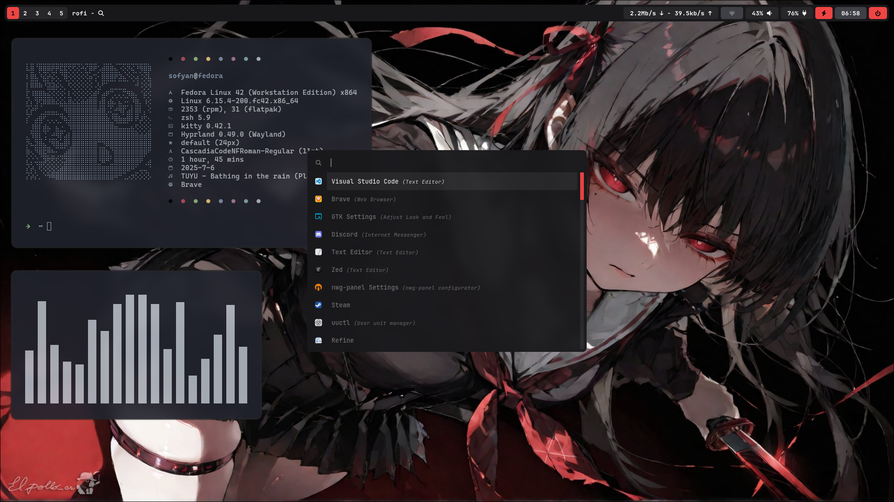

# 🌌 My Hyprland Dots

A minimal yet powerful Hyprland setup crafted for elegance, performance, and customization. Built with precision and just a whisper of darkness~

## ✨ Features

- 🪞 Dynamic tiling with **Hyprland**
- 🖼️ Wallpaper management using **Hyperpaper** & **Waypaper**
- 💻 Terminal : **Kitty**, fast and GPU-accelerated
- 📟 Clean, informative **Waybar**
- 🔍 Application launcher using **Rofi**
- 🧾 Fast system info via **Fastfetch**
- 💨 Smooth transitions and animations
- 👆 Touchpad gestures for workspace switching
- 📡 Network and 🔵 Bluetooth tray applets

## 📸 Screenshots



## ⚙️ Requirements

- [**Fedora Workstation 42**](https://www.fedoraproject.org/)
- [**Hyprland**](https://github.com/hyprwm/Hyprland)
- `kitty` – terminal emulator (GPU-based and themeable)
- `hyperpaper` – lightweight wallpaper tool
- `waypaper` – GUI wallpaper manager
- `fastfetch` – for fetching system info
- `waybar`, `rofi` – bar and launcher
- `network-manager-applet`, `blueman` – for tray support
- `mako` - for notification

## 💻 Installation

- Install requirement

```bash
# install requirement
sudo dnf install hyprland
sudo dnf install rofi
sudo dnf install waybar
sudo dnf install power-profiles-daemon
sudo dnf install grim slurp wl-clipboard
# hyprpaper
sudo dnf install dnf-plugins-core
sudo dnf copr enable solopasha/hyprland
sudo dnf install hyprpaper
# waypaper
sudo dnf install waypaper
# notification daemon
sudo dnf install mako
# network manager
sudo dnf install NetworkManager network-manager-applet
# bluetooth manager
sudo dnf install bluez bluez-tools blueman
# apply gtk-theme
sudo dnf install nwg-look
sudo dnf install adw-gtk3-theme
sudo flatpak override --filesystem=xdg-data/themes
sudo flatpak mask org.gtk.Gtk3theme.adw-gtk3-dark
```

- Copy all folders in **config** folder to **~/.config**
- Copy all fonts to to **~/.local/share/fonts**
- Copy all icons to to **~/.icons**
- Set GTK-Theme using **nwg-look**

## 🔧 Customization

**Wallpapers :** Put your favorites in the **Pictures/wallpapers/** folder and configure **hyperpaper.conf**

**Monitors :** Ensure correct monitor names (e.g., eDP-1, HDMI-A-1)

**Keybindings :** Adjust **bind=** lines in **hyprland.conf**

## ❤️ Credits

### Special thanks to:

**Fedora** for best Distro

**Hyprland** for the amazing Wayland WM

The open-source community for endless inspiration
