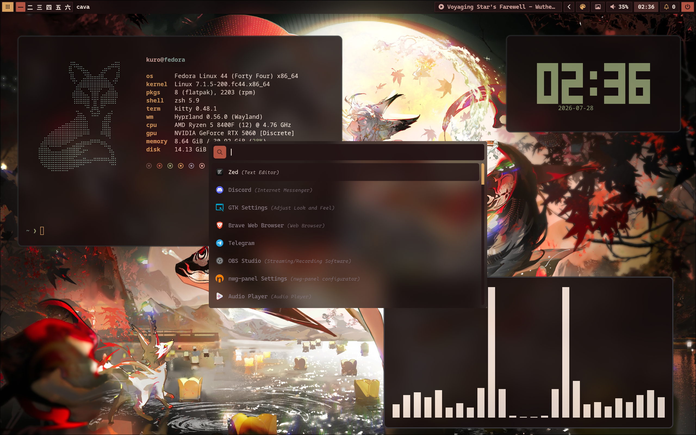

# 🌌 My Hyprland Dots

A minimal yet powerful Hyprland setup crafted for elegance, performance, and customization. Built with precision and just a whisper of darkness~

## ✨ Features

- 🪞 Dynamic tiling with **Hyprland**, configured via its native **Lua** config (`hyprland.lua`)
- 🌀 Switchable **dwindle** / **scrolling** layout (`SUPER + W`)
- 🖼️ Wallpaper management using **awww** (swww's successor) & **Waypaper**
- 🔒 Screen locking with **Hyprlock**
- 💻 Terminal : **Kitty**, fast and GPU-accelerated (Sakura Ember theme)
- 📟 Clean, informative **Waybar**
- 🔍 Application launcher using **Rofi**
- 🧾 Fast system info via **Fastfetch**
- 💨 Smooth transitions and animations
- 👆 Touchpad gestures for workspace switching
- 📡 Network and 🔵 Bluetooth tray applets

## 📸 Screenshots



## ⚙️ Requirements

- [**Fedora Workstation**](https://www.fedoraproject.org/) 39+
- [**Hyprland**](https://github.com/hyprwm/Hyprland)
- `kitty` – terminal emulator (GPU-based and themeable)
- `hyprlock` – GPU-accelerated screen locker
- `awww` – efficient animated wallpaper daemon (swww's successor)
- `waypaper` – GUI wallpaper manager
- `fastfetch` – for fetching system info
- `waybar`, `rofi` – bar and launcher
- `network-manager-applet`, `blueman` – for tray support
- `mako` – for notifications
- `papirus-icon-theme` – icon theme

## 💻 Installation

### Auto Installation

```bash
git clone https://github.com/sofyan-rs/hyprdots.git
cd hyprdots
chmod +x install.sh
./install.sh
```

### Manual Installation

- Install requirements

```bash
# core packages
sudo dnf install hyprland
sudo dnf install rofi
sudo dnf install waybar
sudo dnf install power-profiles-daemon
sudo dnf install grim slurp wl-clipboard
sudo dnf install hyprpicker
sudo dnf install papirus-icon-theme

# hyprlock (COPR)
sudo dnf install dnf-plugins-core
sudo dnf copr enable solopasha/hyprland
sudo dnf install hyprlock

# awww - wallpaper daemon (COPR)
sudo dnf copr enable alebastr/sway-extras
sudo dnf install awww

# waypaper - wallpaper GUI
sudo dnf install waypaper

# notification daemon
sudo dnf install mako
sudo dnf install python3-pydbus

# network manager
sudo dnf install NetworkManager network-manager-applet

# bluetooth manager
sudo dnf install bluez bluez-tools blueman

# apply gtk-theme
sudo dnf install nwg-look
sudo dnf install adw-gtk3-theme
sudo flatpak override --filesystem=xdg-data/themes
sudo flatpak mask org.gtk.Gtk3theme.adw-gtk3-dark
```

- Clone this repository

```bash
git clone https://github.com/sofyan-rs/hyprdots.git
cd hyprdots
```

- Copy all config folders to **~/.config**

```bash
cp -r .config/* ~/.config/
```

- Copy fonts and the cursor theme to **~/.local/share**

```bash
mkdir -p ~/.local/share/fonts ~/.local/share/icons
cp -r .local/share/fonts/* ~/.local/share/fonts/
cp -r .local/share/icons/* ~/.local/share/icons/
fc-cache -fv
```

- Copy wallpapers to **~/Pictures/Wallpapers**

```bash
mkdir -p ~/Pictures/Wallpapers
cp -r wallpapers/* ~/Pictures/Wallpapers/
```

- Copy **.local/bin/waybar-mako-notif.py** to **~/.local/bin**

```bash
mkdir -p ~/.local/bin
cp .local/bin/waybar-mako-notif.py ~/.local/bin/
chmod +x ~/.local/bin/waybar-mako-notif.py
```

- Set GTK-Theme using **nwg-look**
- Open **waypaper** once and pick **awww** as the backend (this also sets your wallpaper)
- Reboot

## ⌨️ Keybindings

| Keybind | Action |
|---|---|
| `SUPER + Return` | Open terminal (Kitty) |
| `SUPER + Q` | Close active window |
| `SUPER + E` | Open file manager (Nautilus) |
| `SUPER + V` | Toggle floating |
| `SUPER + P` | Toggle pseudotile |
| `SUPER + J` | Toggle split (dwindle) |
| `SUPER + W` | Toggle layout (dwindle ↔ scrolling) |
| `SUPER + R` | Restart Waybar |
| `SUPER + M` | Exit Hyprland |
| `ALT + Space` | App launcher (Rofi) |
| `ALT + ←/→/↑/↓` | Move focus |
| `SUPER + ←/→` | Switch to previous/next workspace |
| `SUPER + scroll` | Cycle through workspaces |
| `SUPER + [0-9]` | Switch to workspace 1-10 |
| `SUPER + SHIFT + [0-9]` | Move active window to workspace 1-10 |
| `SUPER + SHIFT + ←/→/↑/↓` | Move window position in layout |
| `SUPER + CTRL + ←/→/↑/↓` | Resize active window |
| `SUPER + S` | Toggle special workspace (scratchpad) |
| `SUPER + SHIFT + S` | Move active window to special workspace |
| `SUPER + LMB drag` | Move window |
| `SUPER + RMB drag` | Resize window |
| `Print` | Screenshot region to clipboard |
| Volume/brightness/media keys | Handled via `wpctl`, `brightnessctl`, `playerctl` |

Full list (and how to change binds) lives in `hl.bind(...)` calls inside `hyprland.lua`.

## 🔧 Customization

**Wallpapers :** Put your favorites in **~/Pictures/Wallpapers/** and pick one via **waypaper** — the wallpaper button on Waybar opens the picker, and `awww-daemon` / `waypaper --restore` bring it back on login.

**Monitors :** Ensure correct monitor output name and mode in `hyprland.lua` (`hl.monitor({ ... })`).

**Keybindings :** See the table above, or adjust the `hl.bind(...)` calls in `hyprland.lua` directly.

**Lock screen wallpaper :** Set the `$wallpaper` variable in `hyprlock.conf`.

**Terminal theme :** Swap the `include` line at the top of `kitty.conf` between `SakuraEmber.conf` and `SpaceGray.conf`.

## ❤️ Credits

### Special thanks to:

**Fedora** for best Distro

**Hyprland** for the amazing Wayland WM

The open-source community for endless inspiration
