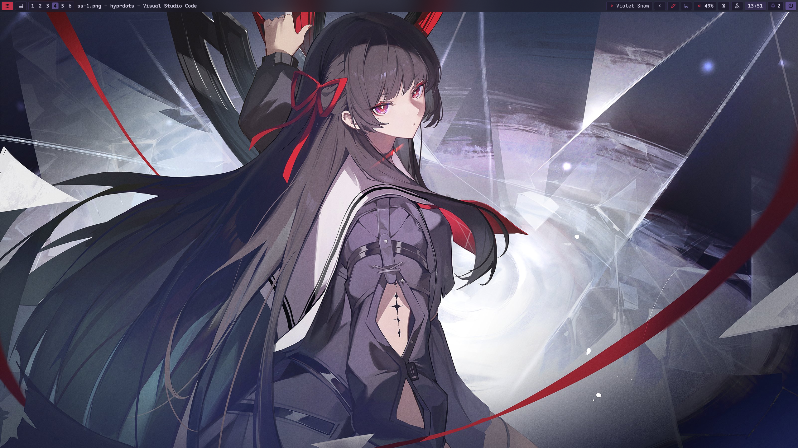
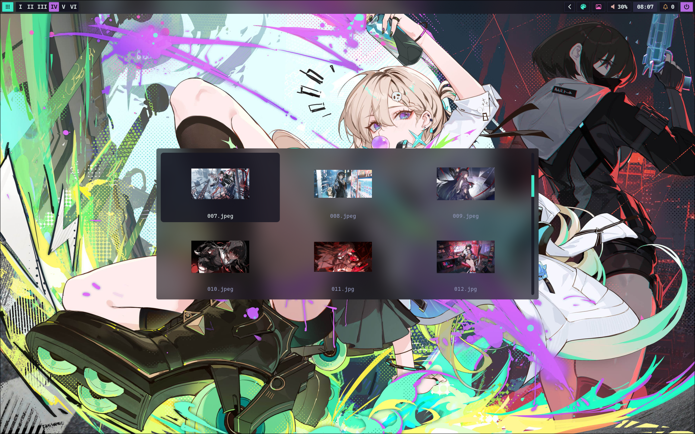
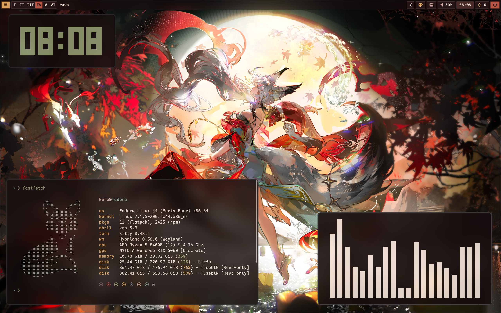
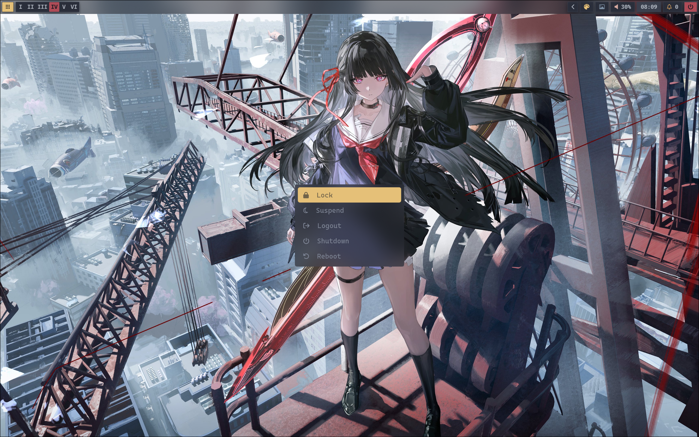

# 🌌 My Hyprland Dots

A minimal yet powerful Hyprland setup crafted for elegance, performance, and customization. Built with precision and just a whisper of darkness~

## ✨ Features

- 🪞 Dynamic tiling with **Hyprland**, configured via its native **Lua** config (`hyprland.lua`)
- 🌀 Switchable **dwindle** / **scrolling** layout (`SUPER + W`)
- 🖼️ Wallpaper management using **awww** (swww's successor) & **Waypaper**
- 🎨 Dynamic theming — kitty and quickshell colors auto-switch to match your wallpaper
- 🔒 Screen locking with **Hyprlock**
- 💻 Terminal : **Kitty**, fast and GPU-accelerated
- 📟 Clean, informative status bar built with **Quickshell** (native QML — bar, notifications, app launcher, wallpaper picker, power menu)
- 🧾 Fast system info via **Fastfetch**
- 💨 Smooth transitions and animations
- 👆 Touchpad gestures for workspace switching
- 📡 Native Network and 🔵 Bluetooth widgets built with Quickshell

## 📸 Screenshots






## ⚙️ Requirements

- [**Fedora Workstation**](https://www.fedoraproject.org/) 39+
- [**Hyprland**](https://github.com/hyprwm/Hyprland)
- `kitty` – terminal emulator (GPU-based and themeable)
- `hyprlock` – GPU-accelerated screen locker
- `awww` – efficient animated wallpaper daemon (swww's successor)
- `waypaper` – GUI wallpaper manager
- `fastfetch` – for fetching system info
- `cava` – audio visualizer for the media widget
- `quickshell` – bar, notifications, app launcher, wallpaper picker, power menu, and native network/bluetooth widgets
- `NetworkManager`, `bluez`, `bluez-tools` – backend services for the Network/Bluetooth widgets
- `papirus-icon-theme` – icon theme

## 💻 Installation

### Auto Installation

```bash
git clone https://github.com/sofyan-rs/hyprdots.git
cd hyprdots
chmod +x install.sh
./install.sh
```

### Manual Installation

- Install requirements

```bash
# Hyprland + hyprlock (COPR)
sudo dnf install dnf-plugins-core
sudo dnf copr enable lionheartp/Hyprland
sudo dnf install hyprland hyprlock

# core packages
sudo dnf install power-profiles-daemon
sudo dnf install grim slurp wl-clipboard
sudo dnf install hyprpicker
sudo dnf install fastfetch
sudo dnf install cava

# awww - wallpaper daemon (COPR)
sudo dnf copr enable alebastr/sway-extras
sudo dnf install awww

# quickshell - bar, notifications, launcher, wallpaper picker, power menu
sudo dnf install quickshell

# waypaper - wallpaper GUI
sudo dnf install waypaper

# network manager (backend for Quickshell's Network widget)
sudo dnf install NetworkManager

# bluetooth (backend for Quickshell's Bluetooth widget)
sudo dnf install bluez bluez-tools

# apply gtk-theme
sudo dnf install nwg-look
sudo dnf install adw-gtk3-theme
sudo flatpak override --filesystem=xdg-data/themes
sudo flatpak mask org.gtk.Gtk3theme.adw-gtk3-dark
sudo dnf install papirus-icon-theme
```

- Clone this repository

```bash
git clone https://github.com/sofyan-rs/hyprdots.git
cd hyprdots
```

- Copy all config folders to **~/.config**

```bash
cp -r .config/* ~/.config/
```

- Copy fonts and the cursor theme to **~/.local/share**

```bash
mkdir -p ~/.local/share/fonts ~/.local/share/icons
cp -r .local/share/fonts/* ~/.local/share/fonts/
cp -r .local/share/icons/* ~/.local/share/icons/
fc-cache -fv
```

- Copy wallpapers to **~/Pictures/Wallpapers**

```bash
mkdir -p ~/Pictures/Wallpapers
cp -r wallpapers/* ~/Pictures/Wallpapers/
```

- Set GTK-Theme using **nwg-look**
- Open **waypaper** once and pick **awww** as the backend (this also sets your wallpaper)
- Confirm `post_command = ~/.config/theme/apply-theme.sh "$wallpaper"` is set in `~/.config/waypaper/config.ini` (already copied above) so switching wallpapers auto-updates kitty/quickshell colors — see **Dynamic Theme** under Customization below
- Reboot

## ⌨️ Keybindings

| Keybind                      | Action                                                               |
| ---------------------------- | -------------------------------------------------------------------- |
| `SUPER + Return`             | Open terminal (Kitty)                                                |
| `SUPER + Q`                  | Close active window                                                  |
| `SUPER + E`                  | Open file manager (Nautilus)                                         |
| `SUPER + B`                  | Open browser (Brave)                                                 |
| `SUPER + V`                  | Toggle floating                                                      |
| `SUPER + P`                  | Toggle pseudotile                                                    |
| `SUPER + J`                  | Toggle split (dwindle)                                               |
| `SUPER + W`                  | Toggle layout (dwindle ↔ scrolling)                                  |
| `SUPER + SHIFT + W`          | Open wallpaper picker (Quickshell) — also applies the matching theme |
| `SUPER + R`                  | Restart Quickshell                                                   |
| `SUPER + M`                  | Exit Hyprland                                                        |
| `ALT + Space`                | App launcher (Quickshell)                                            |
| `ALT + ←/→/↑/↓`              | Move focus                                                           |
| `SUPER + ←/→`                | Switch to previous/next workspace                                    |
| `SUPER + scroll`             | Cycle through workspaces                                             |
| `SUPER + [0-9]`              | Switch to workspace 1-10                                             |
| `SUPER + SHIFT + [0-9]`      | Move active window to workspace 1-10                                 |
| `SUPER + SHIFT + ←/→/↑/↓`    | Move window position in layout                                       |
| `SUPER + CTRL + ←/→/↑/↓`     | Resize active window                                                 |
| `SUPER + S`                  | Toggle special workspace (scratchpad)                                |
| `SUPER + SHIFT + S`          | Move active window to special workspace                              |
| `SUPER + LMB drag`           | Move window                                                          |
| `SUPER + RMB drag`           | Resize window                                                        |
| `Print`                      | Screenshot region to clipboard                                       |
| Volume/brightness/media keys | Handled via `wpctl`, `brightnessctl`, `playerctl`                    |

Full list (and how to change binds) lives in `hl.bind(...)` calls inside `hypr/config/keybinds.lua`.

## 🔧 Customization

`hyprland.lua` just `require()`s per-topic files under `hypr/config/` (monitors, keybinds, appearance, layouts, input, window rules, etc.) — see the comment at the top of `hyprland.lua` for the full list.

**Wallpapers :** Put your favorites in **~/Pictures/Wallpapers/** and pick one via **waypaper** — the wallpaper button on the bar opens Quickshell's own grid picker, and `awww-daemon` / `waypaper --restore` bring it back on login.

**Monitors :** Ensure correct monitor output name and mode in `hypr/config/monitors.lua` (`hl.monitor({ ... })`).

**Keybindings :** See the table above, or adjust the `hl.bind(...)` calls in `hypr/config/keybinds.lua` directly.

**Quickshell :** Lives in `.config/quickshell/`, organized per feature (`bar/`, `clock/`, `volume/`, `notifications/`, `power/`, `launcher/`, `wallpaper/`, plus shared singletons in `core/`). Edits hot-reload automatically while it's running — no restart needed, except after adding or moving files (`SUPER + R` restarts it). The app launcher and wallpaper picker are also reachable from any script via `qs ipc call launcher toggle` / `qs ipc call wallpaper toggle`.

**Dynamic theme :** `~/.config/theme/apply-theme.sh` picks a color palette based on the active wallpaper and regenerates `kitty/theme.conf`, `theme/quickshell-colors.css` and `hypr/hyprlock-colors.conf`, then reloads kitty and hyprlock. Quickshell picks up its color file changes live (no restart). It's triggered automatically by waypaper's `post_command` (see Installation), no matter how the wallpaper was changed — the bar's wallpaper menu, `SUPER + SHIFT + W`, or the waypaper GUI itself. Kitty and hyprlock no longer have static per-theme config files — colors are only set through this system.

- Palettes live in `.config/theme/palettes/*.sh`. Add a new one by copying an existing file and adjusting the colors.
- `.config/theme/wallpapers.conf` maps `<wallpaper filename>=<palette name>`. Unmapped wallpapers fall back to `sakura-ember`.
- Run `~/.config/theme/apply-theme.sh` with no arguments to reapply the theme for whatever wallpaper is currently set.

## 🛠️ Troubleshooting

**Hyprlock always says "Wrong Password" :** Usually caused by `pam_fprintd` or `pam_faillock` interfering with the auth stack in `/etc/pam.d/hyprlock`, not `hyprlock.conf` itself. See [`.config/hypr/README-hyprlock-wrong-password.md`](.config/hypr/README-hyprlock-wrong-password.md) for the full diagnosis and fix.

**Steam game won't launch on a dual-boot NTFS partition :** Caused by `ntfs-3g` mounting the partition without `uid=`/`gid=` options, so Proton refuses to run because its prefix isn't owned by you. See [`FIX-STEAM-DUAL-PARTITION.md`](FIX-STEAM-DUAL-PARTITION.md) for the fix.

## ❤️ Credits

### Special thanks to:

**Fedora** for best Distro

**Hyprland** for the amazing Wayland WM

The open-source community for endless inspiration
