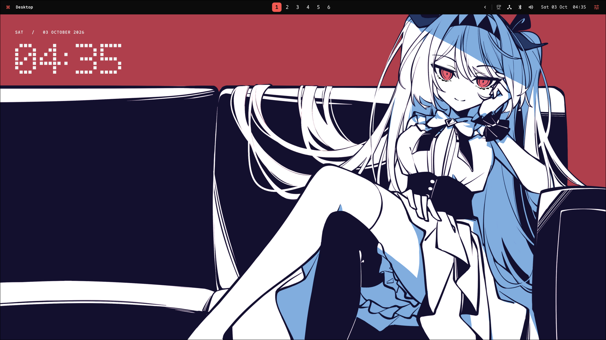
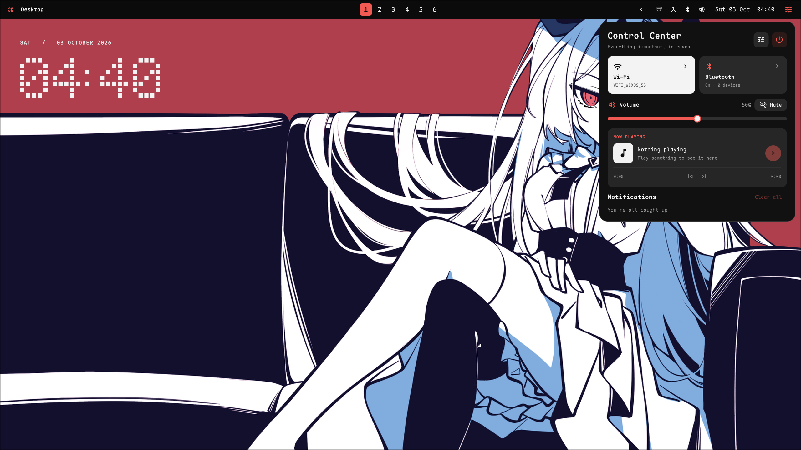
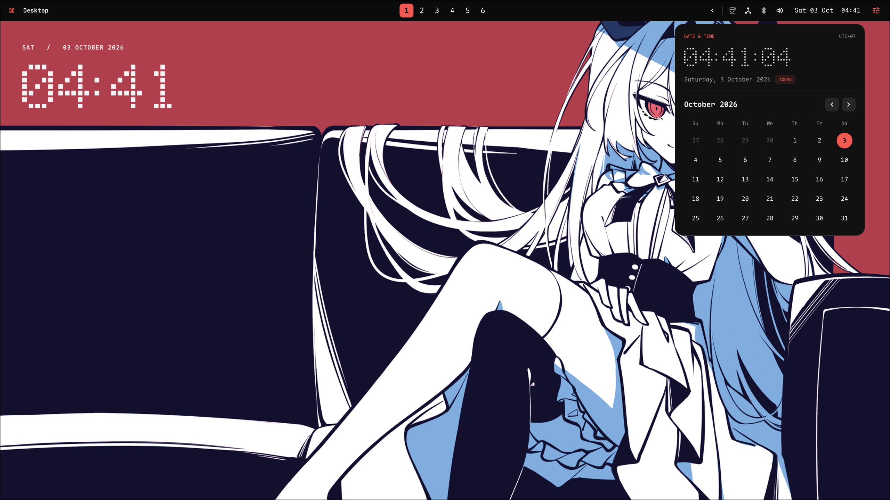
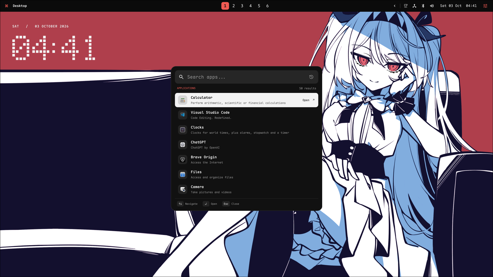
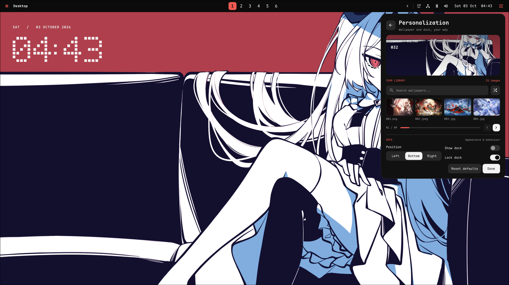
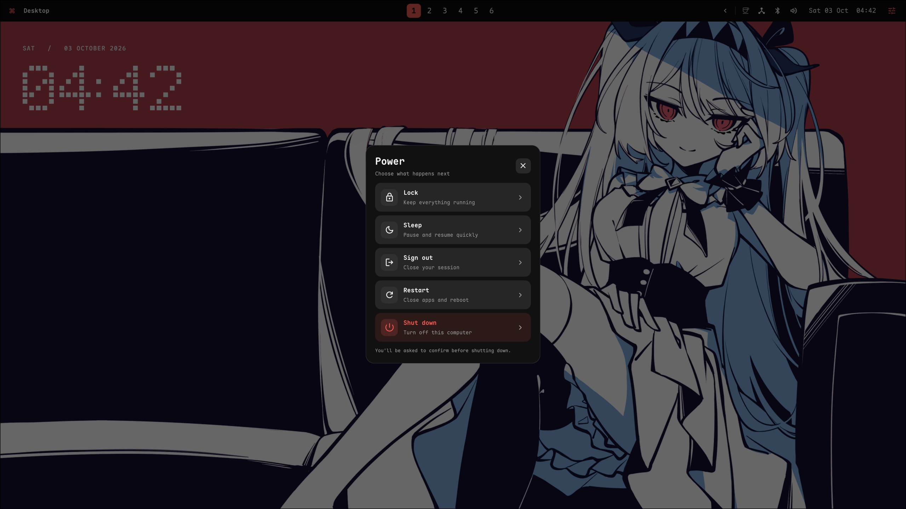

# 🌌 My Hyprland Dots

A minimal yet powerful Hyprland setup crafted for elegance, performance, and customization. Built with precision and just a whisper of darkness~

## ✨ Features

- 🪞 Dynamic tiling with **Hyprland**, using native **Lua** config (`hyprland.lua`)
- 🌀 Switchable **dwindle** / **scrolling** layout (`SUPER + W`)
- 📟 **Quickshell** bar with centered workspaces, system tray, calendar, volume popup, and app launcher
- 🎛️ **Control Center** for Wi-Fi, saved networks, Bluetooth pairing, volume, media playback, and notifications
- 🔐 **Quickshell lock screen** with PAM authentication on every monitor (`SUPER + L`)
- 🔒 Power dialog with lock, sleep, sign out, restart, and shutdown; session-ending actions ask for confirmation
- 🖼️ **Personalization** panel with searchable wallpaper previews, shuffle, and dock settings, backed by **awww** and **Waypaper**
- 🎨 Shared **Nothing** palette for Kitty and Quickshell, with support for custom wallpaper-to-palette mappings
- 🚢 App **dock** with pinned apps, a running-window picker, left/bottom/right placement, and position locking
- 📋 **Global menu** for compatible applications
- 🕒 Dot-matrix desktop clock and date on each monitor
- ☕ **Caffeine** toggle to inhibit idle sleep; **Hypridle** otherwise suspends after 30 minutes of inactivity
- 💻 **Kitty** terminal with Maple Mono NF and a cursor trail; **Fastfetch** for system information
- 💨 Desktop animations and touchpad workspace gestures

## 📸 Screenshots








## ⚙️ Requirements

- [**Fedora Workstation**](https://www.fedoraproject.org/) — the installation commands below use `dnf` and COPR
- [**Hyprland**](https://github.com/hyprwm/Hyprland) with native Lua configuration and the scrolling layout supported by this config
- `quickshell` with Hyprland, PipeWire, MPRIS, notification, Bluetooth, PAM, and Wayland session-lock modules
- `kitty`, `fastfetch`, and `hypridle`
- `awww` and `waypaper` for wallpaper rendering and selection
- `NetworkManager` (`nmcli`) and `bluez` (`bluetoothctl`) for connection management
- PipeWire and `wireplumber` (`wpctl`) for audio; `playerctl` for media keys
- `python3`, `python3-dbus`, and `python3-gobject` for the network and global-menu helpers
- `ImageMagick` (`magick`) for WebP wallpaper previews; `binutils` (`objcopy`) for the Nautilus menu integration
- `grim`, `slurp`, `wl-clipboard`, and `brightnessctl` for screenshot and hardware keybindings
- `xdg-desktop-portal`, `xdg-desktop-portal-hyprland`, and `xdg-desktop-portal-gtk` for desktop integration
- `qt6-qtbase-gui` for the GTK platform theme used when launching Quickshell
- Default applications: Nautilus and Brave Origin (`brave-origin`); change them in `.config/hypr/config/programs.lua`
- Optional quick-settings tools: `pavucontrol`, `nm-connection-editor`, `hyprpicker`, and `libnotify` (`notify-send`)
- [**Hatter**](https://github.com/Mibea/Hatter) icon theme

## 💻 Installation

- Install requirements

```bash
# Hyprland (COPR)
sudo dnf install dnf-plugins-core
sudo dnf copr enable lionheartp/Hyprland
sudo dnf install hyprland hyprland-guiutils hypridle

# terminal, system information, screenshots, and hardware keys
sudo dnf install kitty fastfetch grim slurp wl-clipboard brightnessctl playerctl

# Python helpers, wallpaper previews, and global-menu integration
sudo dnf install python3 python3-dbus python3-gobject ImageMagick binutils

# audio and optional settings tools
sudo dnf install pipewire wireplumber pavucontrol nm-connection-editor hyprpicker libnotify

# desktop portals and Qt's GTK platform theme
sudo dnf install xdg-desktop-portal xdg-desktop-portal-hyprland xdg-desktop-portal-gtk qt6-qtbase-gui

# optional shell setup (no zsh dotfiles are bundled)
sudo dnf install zsh
sh -c "$(curl -fsSL https://raw.githubusercontent.com/ohmyzsh/ohmyzsh/master/tools/install.sh)"

# awww - wallpaper daemon (COPR)
sudo dnf copr enable alebastr/sway-extras
sudo dnf install awww

# quickshell - bar, control center, launcher, personalization, dock, and lock screen
sudo dnf install quickshell

# waypaper - wallpaper GUI
sudo dnf install waypaper

# NetworkManager - control center network backend
sudo dnf install NetworkManager

# Bluetooth - Quickshell integration and pairing agent
sudo dnf install bluez

# apply gtk-theme
sudo dnf install nwg-look
sudo dnf install adw-gtk3-theme
sudo flatpak override --filesystem=xdg-data/themes
sudo flatpak mask org.gtk.Gtk3theme.adw-gtk3-dark
```

- Clone this repository

```bash
git clone https://github.com/sofyan-rs/hyprdots.git
cd hyprdots
```

- Copy all config folders to **~/.config**

```bash
mkdir -p ~/.config
cp -r .config/* ~/.config/
```

- Copy fonts and the cursor theme to **~/.local/share**

```bash
mkdir -p ~/.local/share/fonts ~/.local/share/icons
cp -r .local/share/fonts/* ~/.local/share/fonts/
cp -r .local/share/icons/* ~/.local/share/icons/
fc-cache -fv
```

- Copy wallpapers to **~/Pictures/Wallpapers**

```bash
mkdir -p ~/Pictures/Wallpapers
cp -r wallpapers/* ~/Pictures/Wallpapers/
```

- Set your GTK theme and Hatter icon theme using **nwg-look**.
- Adjust `~/.config/hypr/config/monitors.lua` for your displays. The copied config targets `DP-1` and `DP-2` with fractional scaling.
- Review `~/.config/hypr/config/programs.lua` for your terminal, file manager, and browser commands.
- Open **Waypaper**, select **awww**, and choose a wallpaper from `~/Pictures/Wallpapers`.
- Keep `post_command = ~/.config/theme/apply-theme.sh "$wallpaper"` in `~/.config/waypaper/config.ini` so wallpaper changes regenerate the shared theme files. Remove or replace the copied `stylesheet = /home/kuro/.config/waypaper/style.css` path if it does not exist on your machine.
- Log out and start Hyprland, or reboot. The session starts Quickshell, Hypridle, the desktop portals, `awww-daemon`, and `waypaper --restore`.

## ⌨️ Keybindings

| Keybind                      | Action                                              |
| ---------------------------- | --------------------------------------------------- |
| `SUPER + Return`             | Open terminal (Kitty)                               |
| `SUPER + Q`                  | Close active window                                 |
| `SUPER + E`                  | Open file manager (Nautilus)                        |
| `SUPER + B`                  | Open browser (Brave Origin)                         |
| `SUPER + V`                  | Toggle floating                                     |
| `SUPER + P`                  | Toggle pseudotile                                   |
| `SUPER + J`                  | Toggle split (dwindle)                              |
| `SUPER + W`                  | Toggle layout (dwindle ↔ scrolling)                 |
| `SUPER + SHIFT + W`          | Open Personalization (wallpapers and dock settings) |
| `SUPER + L`                  | Lock the session (Quickshell)                        |
| `SUPER + R`                  | Restart Quickshell                                  |
| `SUPER + M`                  | Exit Hyprland (uses `hyprshutdown` if available)    |
| `ALT + Space`                | App launcher (Quickshell)                           |
| `ALT + ←/→/↑/↓`              | Move focus                                          |
| `SUPER + ←/→`                | Switch to previous/next workspace                   |
| `SUPER + scroll`             | Cycle through workspaces                            |
| `SUPER + [0-9]`              | Switch to workspace 1-10                            |
| `SUPER + SHIFT + [0-9]`      | Move active window to workspace 1-10                |
| `SUPER + SHIFT + ←/→/↑/↓`    | Move window position in layout                      |
| `SUPER + CTRL + ←/→/↑/↓`     | Resize active window                                |
| `SUPER + S`                  | Toggle special workspace (scratchpad)               |
| `SUPER + SHIFT + S`          | Move active window to special workspace             |
| `SUPER + LMB drag`           | Move window                                         |
| `SUPER + RMB drag`           | Resize window                                       |
| `Print`                      | Screenshot region to clipboard                      |
| Volume/brightness/media keys | Handled via `wpctl`, `brightnessctl`, `playerctl`   |

Full list (and how to change binds) lives in `hl.bind(...)` calls inside `hypr/config/keybinds.lua`.

## 🔧 Customization

**Hyprland:** `.config/hypr/hyprland.lua` loads the topic files under `hypr/config/`. Adjust `monitors.lua` for display modes and scaling, `programs.lua` for application commands, `keybinds.lua` for shortcuts, and `appearance.lua` for borders, blur, curves, and animations. `env.lua` also sets Steam UI scaling to `1.33`; adjust that for your displays.

**Quickshell:** `.config/quickshell/` is organized into `bar/`, `clock/`, `controlcenter/`, `globalmenu/`, `volume/`, `notifications/`, `launcher/`, `wallpaper/`, `dock/`, `lockscreen/`, and shared state in `core/`. The lock screen has its own entry point in `lock.qml`. After copying changes into `~/.config/quickshell`, use `SUPER + R` to restart Quickshell if they have not reloaded. Editing this repository alone does not change the running desktop.

**Control Center:** Click the control center icon at the right of the bar. The home page contains connection tiles, volume, media controls, and notifications. The Wi-Fi and Bluetooth icons open their connection pages directly. Wi-Fi supports saved profiles and autojoin; Bluetooth supports pairing prompts. Use the power button inside the control center for lock, sleep, sign out, restart, or shutdown. Sign out, restart, and shutdown require confirmation.

**Launcher and global menu:** Click the `⌘` icon or press `ALT + Space` to search apps. The launcher supports recent-use and alphabetical sorting. The left side of the bar shows menus from compatible focused applications; availability depends on the application exposing a supported menu. The bridge lives in `globalmenu/`.

**Wallpapers and dock:** Open Personalization with `SUPER + SHIFT + W` or the personalization button in the control center. Browse or search wallpapers, shuffle the selection, and show/hide the dock, choose its left/bottom/right position, or lock app positions. Dock appearance settings persist in `~/.config/quickshell/dock/settings.json`; the copied settings initially hide the dock and lock its positions. Pinned apps and ordering persist in `~/.cache/quickshell/dock-pinned.json`. Unlock the dock to change app ordering or pinning.

**Desktop clock:** `clock/DesktopClock.qml` places a date and dot-matrix clock near the top left of each monitor. Adjust its margins there; typography and dot sizes live in `DesktopClockContent.qml` and `DotMatrixClock.qml`.

**Lock screen:** `SUPER + L` and the control center Lock button launch a separate Quickshell process on every monitor. Authentication uses `/etc/pam.d/login`. Restarting the desktop shell leaves the locker running. See [the lock screen documentation](.config/quickshell/lockscreen/README.md) for preview commands and details.

**Idle sleep and caffeine:** `~/.config/hypr/hypridle.conf` suspends after 1,800 seconds of inactivity and respects idle inhibitors. Hypridle launches the lock screen for session lock requests and before sleep. The caffeine icon on the bar toggles a `systemd-inhibit` process to block idle sleep while enabled.

**Shared theme:** The only bundled palette is `.config/theme/palettes/nothing.sh`. All wallpapers currently use it; choosing another wallpaper keeps the same colors. `apply-theme.sh` regenerates `kitty/theme.conf` and `theme/quickshell-colors.css`. It signals Kitty to reload, and Quickshell watches its color file. The lock screen reads the selected wallpaper from Waypaper.

- Add a palette by copying `nothing.sh` and adjusting its colors.
- Map a wallpaper to it in `.config/theme/wallpapers.conf` using `<wallpaper filename>=<palette name>`. Unmapped wallpapers and missing palette files fall back to `nothing`.
- Run `~/.config/theme/apply-theme.sh` to regenerate the theme for the current Waypaper wallpaper.

The following IPC commands are also available:

```bash
qs ipc call launcher toggle
qs ipc call wallpaper toggle
qs ipc call caffeine toggle
qs ipc call caffeine status
qs ipc call volume display
qs ipc call globalmenu status
```

## 🛠️ Troubleshooting

**Quickshell lock screen fails to start:** Run `~/.config/quickshell/lockscreen/lock.sh` from a terminal to see errors. The launcher reports a failure if the compositor does not confirm that the session is secured. Ensure your Quickshell build includes the PAM and Wayland session-lock modules. For a visual preview, run `quickshell -p ~/.config/quickshell/lock-preview.qml`; password and power actions are disabled in preview mode. See [the lock screen documentation](.config/quickshell/lockscreen/README.md) for details.

**Steam game won't launch on a dual-boot NTFS partition :** Caused by `ntfs-3g` mounting the partition without `uid=`/`gid=` options, so Proton refuses to run because its prefix isn't owned by you. See [`docs/FIX-STEAM-DUAL-PARTITION.md`](docs/FIX-STEAM-DUAL-PARTITION.md) for the fix.

## ❤️ Credits

### Special thanks to:

**Fedora** for best Distro

**Hyprland** for the amazing Wayland WM

The open-source community for endless inspiration
